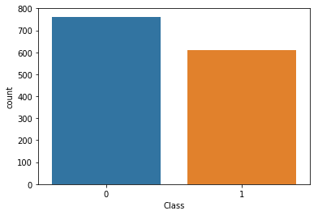

# Real-or-counterfeit
Determine whether a bank note is real or fake using DNN

# Data
Data: [Bank Authentication Data Set](https://archive.ics.uci.edu/ml/datasets/banknote+authentication) from the UCI repository (bank_note_data.csv).

The data consists of 5 columns:

* variance of Wavelet Transformed image (continuous)
* skewness of Wavelet Transformed image (continuous)
* curtosis of Wavelet Transformed image (continuous)
* entropy of image (continuous)
* class (integer)

Where class indicates whether or not a Bank Note was authentic.

We will feed these features into a Neural Network to see if we can predict if a bank note is real or a counterfeit.

# Exploratory Data Analysis
Countplot of the Classes (Authentic 1 vs Fake 0)

PairPlot of the Data

# Scaled data

# Model evaluation
Classification report

# Model comparison: Random Forest Classifier
Classification report

